+++
title = "Testing"
description = "Testing experience"
weight = 2
+++

Since July 2023, I work as a game tester in [BoomBit](https://boombit.com) where I am testing mobile games, console games, playable ads, websites, and web apps.

I have the [ISTQB CTFL certificate](../Tomasz_Nowakowski_CTFL.pdf) and I am planning to get [CTAL-TA](https://istqb.org/certifications/certified-tester-advanced-level-test-analyst/) soon.

Currently, I am learning Appium and Playwright.

# Ongoing projects

## Appium test suite for Waistline

&nbsp;&nbsp;python&nbsp;&nbsp; &nbsp;&nbsp;appium&nbsp;&nbsp;

Learning project started to learn test automation for mobile platforms. Programmed with Python and Appium, it will contain both low-level functional tests, and e2e test for Waistline app – libre calorie tracker available on Android.

    
    

## Playwright learning

&nbsp;&nbsp;python&nbsp;&nbsp; &nbsp;&nbsp;playwright&nbsp;&nbsp;

Repository that contains tests created for www.automationexercise.com and www.practicesoftwaretesting.com, using Python and Playwright.

    
    

# Tech stack, tools and workflow

## Programming languages

<table class="skilltable">
    <tbody>
        <tr>
            <td>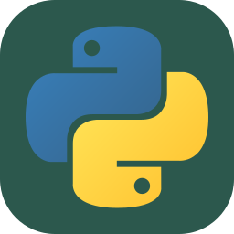</td>
            <td>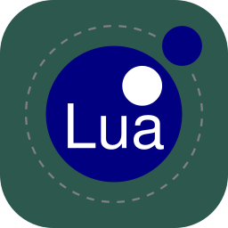</td>
            <td>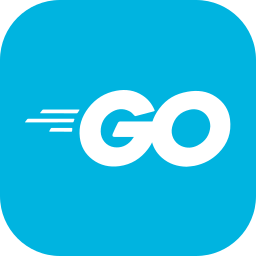</td>
        </tr>
        <tr>
            <td>Python</td>
            <td>Lua</td>
            <td>Go</td>
        </tr>
    </tbody>
</table>

## Project management

<table class="skilltable">
    <tbody>
        <tr>
            <td>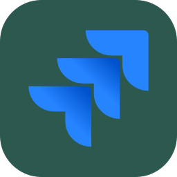</td>
            <td>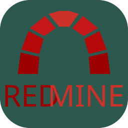</td>
            <td>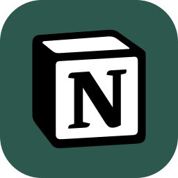</td>
            <td></td>
        </tr>
        <tr>
            <td>Jira</td>
            <td>Redmine</td>
            <td>Notion</td>
            <td>Git</td>
        </tr>
    </tbody>
</table>

## Platforms

<table class="skilltable">
    <tbody>
        <tr>
            <td>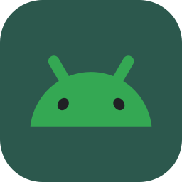</td>
            <td>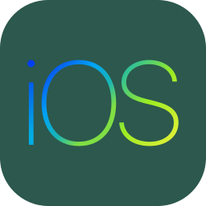</td>
            <td>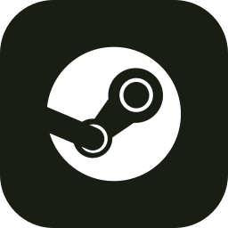</td>
            <td></td>
            <td>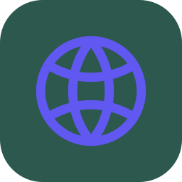</td>
        </tr>
        <tr>
            <td>Android</td>
            <td>iOS</td>
            <td>PC Steam</td>
            <td>Xbox</td>
            <td>Web</td>
        </tr>
    </tbody>
</table>

## Ad frameworks

<table class="skilltable">
    <tbody>
        <tr>
            <td>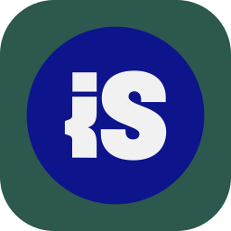</td>
            <td>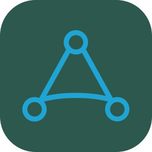</td>
        </tr>
        <tr>
            <td>Iron Source</td>
            <td>AppLovin</td>
        </tr>
    </tbody>
</table>

